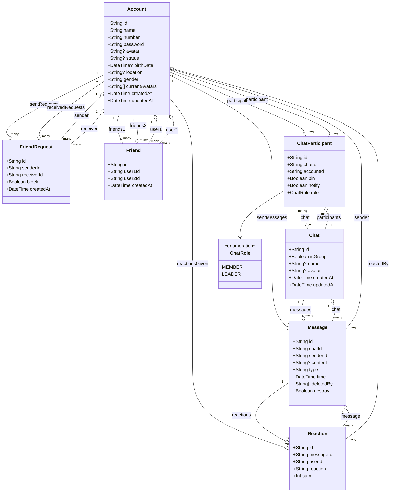

- **Account** có thể gửi/nhận **FriendRequest**
- **Friend** biểu diễn mối quan hệ bạn bè giữa hai **Account**
- **Chat** có nhiều **ChatParticipant** và **Message**
- **Message** có thể nhận nhiều **Reaction** từ _Account_
- **ChatParticipant** có vai trò (**ChatRole**)
