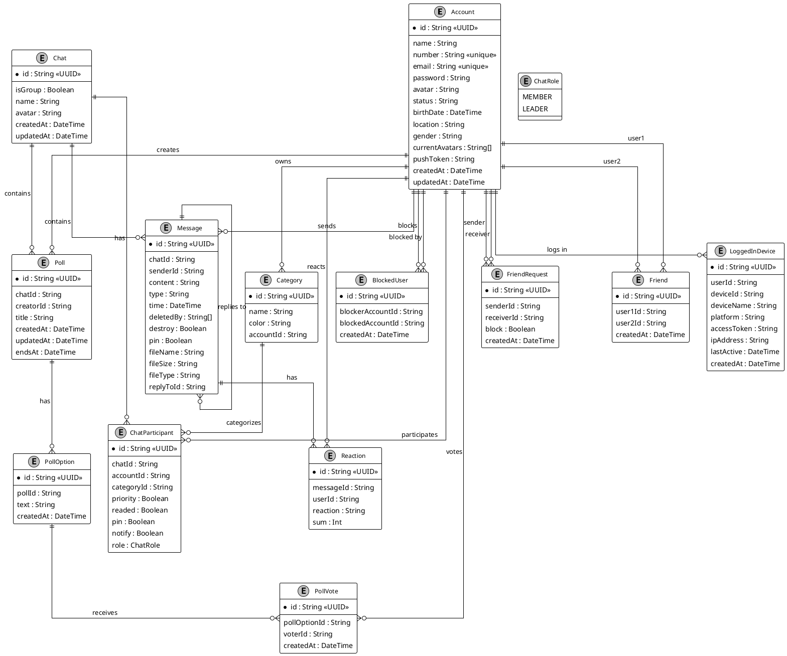

**1. Account:**
- Mô tả: Đại diện cho người dùng trong hệ thống.
- Thuộc tính chính: id (UUID, khóa chính), name, email (duy nhất), password.
- Vai trò: Trung tâm của hệ thống, liên kết với hầu hết các thực thể khác (bạn bè, tin nhắn, bình chọn, v.v.).
- Mối quan hệ: Có nhiều mối quan hệ 1:N và N:N với các thực thể như Category, FriendRequest, Message, Poll, v.v.

**2. Category:**
- Mô tả: Danh mục để phân loại các cuộc trò chuyện của người dùng (ví dụ: "Công việc", "Gia đình").
- Thuộc tính chính: id (UUID), name, accountId (liên kết với Account).
- Mối quan hệ: 1:N với ChatParticipant (một danh mục có thể được gán cho nhiều người tham gia trò chuyện).

**3. FriendRequest:**
- Mô tả: Lời mời kết bạn giữa hai người dùng.
- Thuộc tính chính: id (UUID), senderId, receiverId (liên kết với Account).
- Mối quan hệ: N:N gián tiếp giữa Account qua senderId và receiverId.

**4. Friend:**
- Mô tả: Quan hệ bạn bè đã được xác nhận giữa hai người dùng.
- Thuộc tính chính: id (UUID), user1Id, user2Id (liên kết với Account).
- Mối quan hệ: N:N gián tiếp giữa Account.

**5. Chat:**
- Mô tả: Cuộc trò chuyện (cá nhân hoặc nhóm).
- Thuộc tính chính: id (UUID), isGroup, name.
- Mối quan hệ: 1:N với ChatParticipant, Message, và Poll.

**6. ChatParticipant:**
- Mô tả: Người dùng tham gia một cuộc trò chuyện, với vai trò và trạng thái cụ thể.
- Thuộc tính chính: id (UUID), chatId, accountId, role (liên kết với ChatRole).
- Mối quan hệ: N:N giữa Chat và Account, có thể liên kết với Category.

**7. ChatRole:**
- Mô tả: Enum định nghĩa vai trò trong cuộc trò chuyện (MEMBER hoặc LEADER).
- Vai trò: Được sử dụng trong ChatParticipant để xác định quyền hạn.

**8. Message:**
- Mô tả: Tin nhắn trong một cuộc trò chuyện.
- Thuộc tính chính: id (UUID), chatId, senderId, content.
- Mối quan hệ: 1:N với Reaction, tự tham chiếu qua replyToId (một tin nhắn có thể trả lời tin nhắn khác).

**9. Reaction:**
- Mô tả: Phản ứng (reaction) của người dùng với một tin nhắn (ví dụ: like, heart).
- Thuộc tính chính: id (UUID), messageId, userId.
- Mối quan hệ: N:N giữa Message và Account.

**10. LoggedInDevice:**
- Mô tả: Thiết bị mà người dùng đăng nhập.
- Thuộc tính chính: id (UUID), userId, deviceId.
- Mối quan hệ: 1:N với Account.

**11. BlockedUser:**
- Mô tả: Quan hệ chặn giữa hai người dùng.
- Thuộc tính chính: id (UUID), blockerAccountId, blockedAccountId.
- Mối quan hệ: N:N gián tiếp giữa Account.

**12. Poll:**
- Mô tả: Cuộc bình chọn trong một cuộc trò chuyện.
- Thuộc tính chính: id (UUID), chatId, creatorId, title.
- Mối quan hệ: 1:N với PollOption, liên kết với Chat và Account.

**13. PollOption:**
- Mô tả: Lựa chọn trong một cuộc bình chọn.
- Thuộc tính chính: id (UUID), pollId, text.
- Mối quan hệ: 1:N với PollVote.

**14. PollVote:**
- Mô tả: Phiếu bầu của người dùng cho một lựa chọn trong bình chọn.
- Thuộc tính chính: id (UUID), pollOptionId, voterId.
- Mối quan hệ: N:N giữa PollOption và Account.