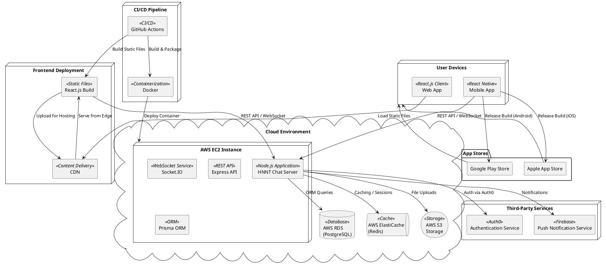

---

## Frontend (FE)

### Mobile App

- Sử dụng **React Native** để phát triển ứng dụng di động.
- Giao tiếp với backend thông qua **REST API** hoặc **WebSocket**.

### Web App

- Sử dụng **React.js** để phát triển giao diện web.
- React.js được build thành các **file tĩnh** (`HTML`, `CSS`, `JS`) và được triển khai trên một **CDN (Content Delivery Network)** để tăng tốc độ tải.

### Frontend Deployment

- Các file tĩnh của **React.js** được lưu trữ trên **CDN** (ví dụ: `AWS CloudFront`, `Netlify`).
- Web App tải các file tĩnh từ CDN và giao tiếp với backend qua **REST API** hoặc **WebSocket**.

---

## Backend (BE)

### HNNT Chat Server

- Sử dụng **Node.js** với framework **Express** để xây dựng REST API.
- **Socket.IO** được sử dụng để xử lý giao tiếp thời gian thực (**WebSocket**).
- **Prisma ORM** để giao tiếp với cơ sở dữ liệu **PostgreSQL**.

### Database

- **AWS RDS (PostgreSQL)** được sử dụng để lưu trữ dữ liệu chính.
- **AWS ElastiCache (Redis)** được sử dụng để quản lý **bộ nhớ đệm** và **phiên người dùng**.

### File Storage

- **AWS S3** được sử dụng để lưu trữ các **file tải lên** (hình ảnh, video, tài liệu).

### Third-Party Services

- **Firebase** hoặc dịch vụ tương tự được sử dụng để gửi **thông báo đẩy (push notification)**.
- **Auth0** hoặc dịch vụ tương tự được sử dụng để quản lý **xác thực người dùng**.

---

## CI/CD Pipeline

### GitHub Actions

- Tự động hóa quá trình **build và deploy** cho cả frontend và backend.

### Docker

- Backend được đóng gói trong container **Docker** và triển khai trên **AWS EC2**.

---

## Triển khai (Deployment)

- **Frontend (React.js)** được build và triển khai trên **CDN**.
- **Backend (Node.js)** được triển khai trên **AWS EC2** thông qua **Docker**.
- Các dịch vụ như **cơ sở dữ liệu**, **bộ nhớ đệm**, và **lưu trữ file** được triển khai trên các dịch vụ **AWS tương ứng**.

---
