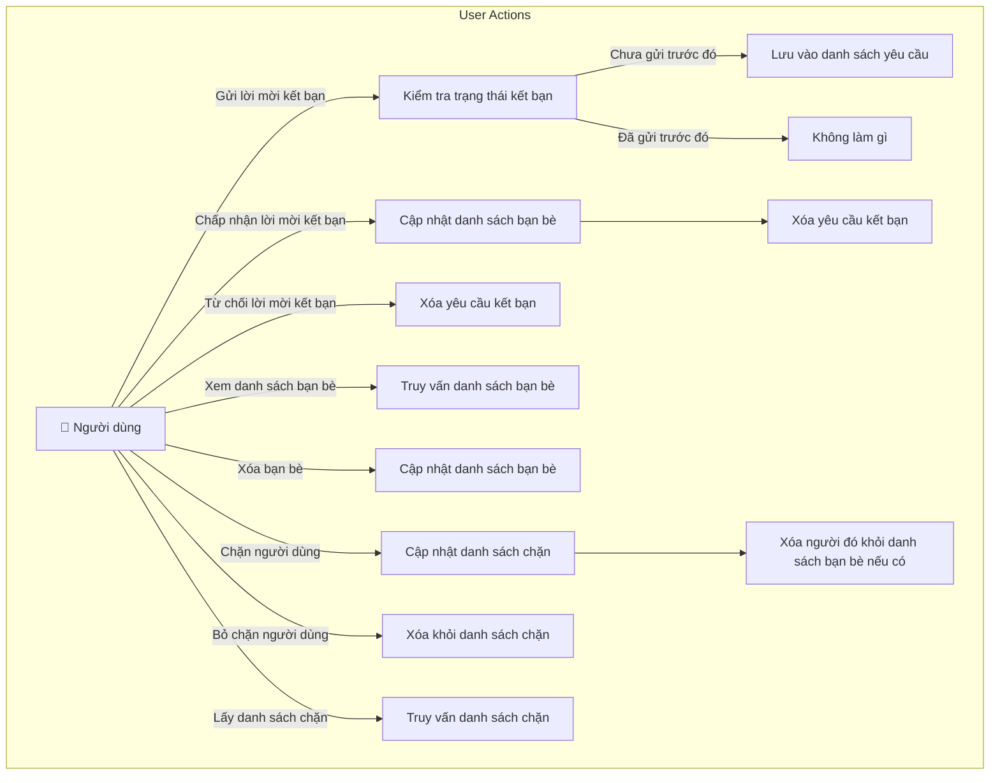

**1. Friends & Contact**

```mermaid
graph TD;
    subgraph User Actions
        A[👤 Người dùng] -->|Gửi lời mời kết bạn| B[Kiểm tra trạng thái kết bạn]
        B -->|Chưa gửi trước đó| C[Lưu vào danh sách yêu cầu]
        B -->|Đã gửi trước đó| D[Không làm gì]

        A -->|Chấp nhận lời mời kết bạn| E[Cập nhật danh sách bạn bè]
        E --> F[Xóa yêu cầu kết bạn]

        A -->|Từ chối lời mời kết bạn| G[Xóa yêu cầu kết bạn]

        A -->|Xem danh sách bạn bè| H[Truy vấn danh sách bạn bè]

        A -->|Xóa bạn bè| I[Cập nhật danh sách bạn bè]

        A -->|Chặn người dùng| J[Cập nhật danh sách chặn]
        J --> K[Xóa người đó khỏi danh sách bạn bè nếu có]

        A -->|Bỏ chặn người dùng| L[Xóa khỏi danh sách chặn]

        A -->|Lấy danh sách chặn| M[Truy vấn danh sách chặn]
    end
```
