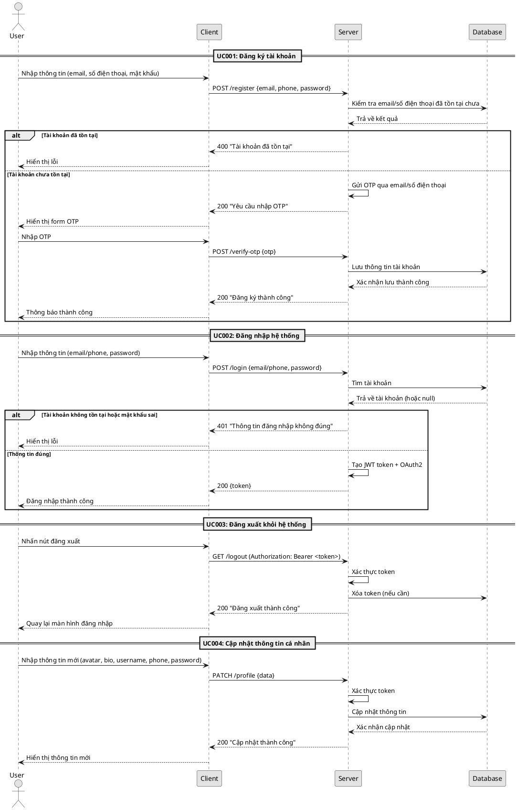
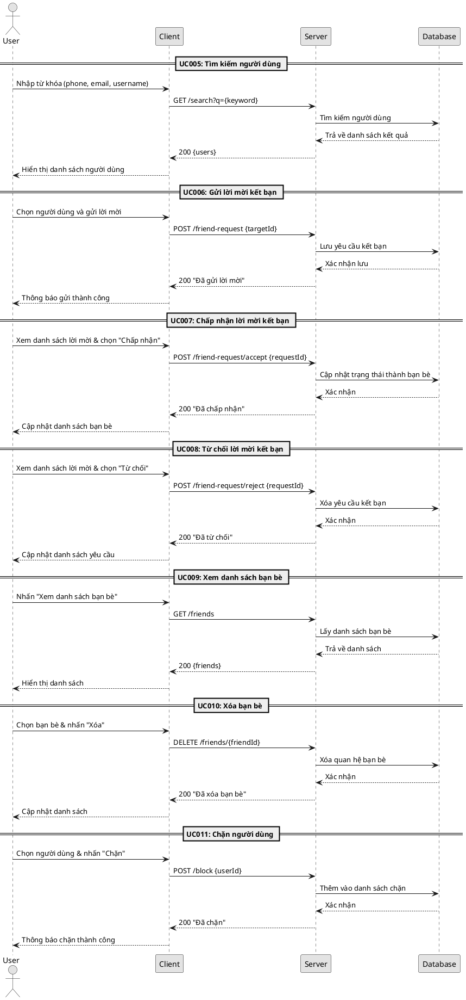
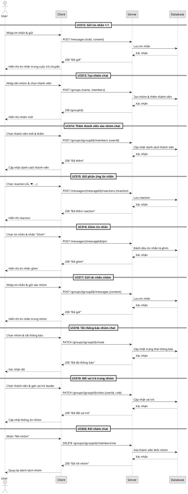
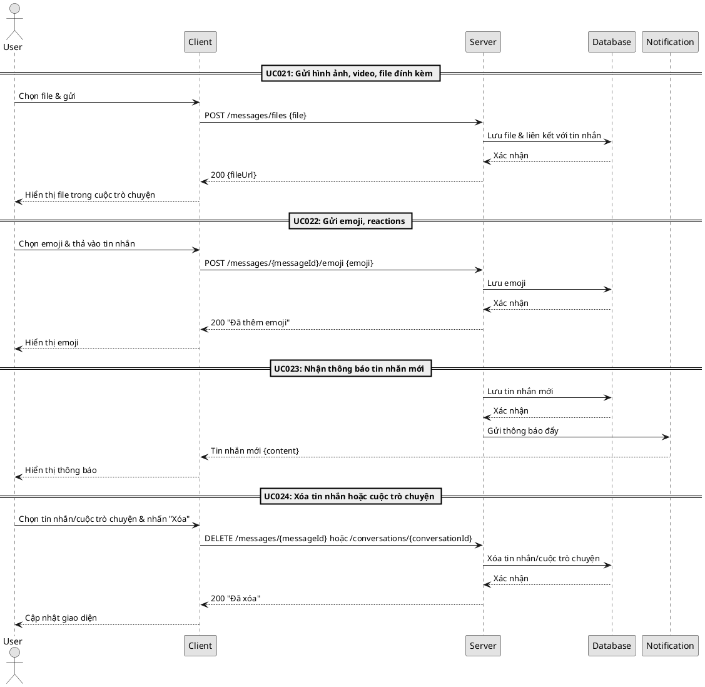

## Nhóm 1: Quản lý tài khoản (UC001 - UC004)

## Nhóm 2: Quản lý kết bạn (UC005 - UC011)

## Nhóm 3: Tin nhắn cá nhân và nhóm (UC012 - UC020)

## Nhóm 4: Tính năng tin nhắn nâng cao (UC021 - UC024)

