## Nhóm 1: Quản lý tài khoản (UC001 - UC004)

```plantuml
@startuml
skinparam monochrome true

actor User
participant "Client" as Client
participant "Server" as Server
participant "Database" as DB

== UC001: Đăng ký tài khoản ==
User -> Client: Nhập thông tin (email, số điện thoại, mật khẩu)
Client -> Server: POST /register {email, phone, password}
Server -> DB: Kiểm tra email/số điện thoại đã tồn tại chưa
DB --> Server: Trả về kết quả
alt Tài khoản đã tồn tại
    Server --> Client: 400 "Tài khoản đã tồn tại"
    Client --> User: Hiển thị lỗi
else Tài khoản chưa tồn tại
    Server -> Server: Gửi OTP qua email/số điện thoại
    Server --> Client: 200 "Yêu cầu nhập OTP"
    Client --> User: Hiển thị form OTP
    User -> Client: Nhập OTP
    Client -> Server: POST /verify-otp {otp}
    Server -> DB: Lưu thông tin tài khoản
    DB --> Server: Xác nhận lưu thành công
    Server -> Server: Tạo JWT token
    Server --> Client: 200 {token} "Đăng ký thành công"
    Client --> User: Thông báo thành công & lưu token
end

== UC002: Đăng nhập hệ thống ==
User -> Client: Nhập thông tin (email/phone, password)
Client -> Server: POST /login {email/phone, password}
Server -> DB: Tìm tài khoản
DB --> Server: Trả về tài khoản (hoặc null)
alt Tài khoản không tồn tại hoặc mật khẩu sai
    Server --> Client: 401 "Thông tin đăng nhập không đúng"
    Client --> User: Hiển thị lỗi
else Thông tin đúng
    Server -> Server: Tạo JWT token
    Server --> Client: 200 {token}
    Client --> User: Đăng nhập thành công & lưu token
end

== UC003: Đăng xuất khỏi hệ thống ==
User -> Client: Nhấn nút đăng xuất
Client -> Server: GET /logout (Authorization: Bearer <token>)
Server -> Server: Xác thực JWT token
alt Token không hợp lệ
    Server --> Client: 401 "Token không hợp lệ"
    Client --> User: Hiển thị lỗi
else Token hợp lệ
    Server -> DB: Xóa token (nếu dùng blacklist)
    DB --> Server: Xác nhận
    Server --> Client: 200 "Đăng xuất thành công"
    Client --> User: Xóa token ở client & quay lại màn hình đăng nhập
end

== UC004: Cập nhật thông tin cá nhân ==
User -> Client: Nhập thông tin mới (avatar, bio, username, phone, password)
Client -> Server: PATCH /profile {data} (Authorization: Bearer <token>)
Server -> Server: Xác thực JWT token
alt Token không hợp lệ
    Server --> Client: 401 "Token không hợp lệ"
    Client --> User: Hiển thị lỗi & yêu cầu đăng nhập lại
else Token hợp lệ
    Server -> DB: Cập nhật thông tin
    DB --> Server: Xác nhận cập nhật
    Server --> Client: 200 "Cập nhật thành công"
    Client --> User: Hiển thị thông tin mới
end

@enduml
```

## Nhóm 2: Quản lý kết bạn (UC005 - UC011)

```plantuml
@startuml
skinparam monochrome true

actor User
participant "Client" as Client
participant "Server" as Server
participant "Database" as DB

== UC005: Tìm kiếm người dùng ==
User -> Client: Nhập từ khóa (phone, email, username)
Client -> Server: GET /search?q={keyword} (Authorization: Bearer <token>)
Server -> Server: Xác thực JWT token
alt Token không hợp lệ
    Server --> Client: 401 "Token không hợp lệ"
    Client --> User: Hiển thị lỗi & yêu cầu đăng nhập lại
else Token hợp lệ
    Server -> DB: Tìm kiếm người dùng
    DB --> Server: Trả về danh sách kết quả
    Server --> Client: 200 {users}
    Client --> User: Hiển thị danh sách người dùng
end

== UC006: Gửi lời mời kết bạn ==
User -> Client: Chọn người dùng và gửi lời mời
Client -> Server: POST /friend-request {targetId} (Authorization: Bearer <token>)
Server -> Server: Xác thực JWT token
alt Token không hợp lệ
    Server --> Client: 401 "Token không hợp lệ"
else Token hợp lệ
    Server -> DB: Lưu yêu cầu kết bạn
    DB --> Server: Xác nhận lưu
    Server --> Client: 200 "Đã gửi lời mời"
    Client --> User: Thông báo gửi thành công
end

== UC007: Chấp nhận lời mời kết bạn ==
User -> Client: Xem danh sách lời mời & chọn "Chấp nhận"
Client -> Server: POST /friend-request/accept {requestId} (Authorization: Bearer <token>)
Server -> Server: Xác thực JWT token
alt Token không hợp lệ
    Server --> Client: 401 "Token không hợp lệ"
else Token hợp lệ
    Server -> DB: Cập nhật trạng thái thành bạn bè
    DB --> Server: Xác nhận
    Server --> Client: 200 "Đã chấp nhận"
    Client --> User: Cập nhật danh sách bạn bè
end

== UC008: Từ chối lời mời kết bạn ==
User -> Client: Xem danh sách lời mời & chọn "Từ chối"
Client -> Server: POST /friend-request/reject {requestId} (Authorization: Bearer <token>)
Server -> Server: Xác thực JWT token
alt Token không hợp lệ
    Server --> Client: 401 "Token không hợp lệ"
else Token hợp lệ
    Server -> DB: Xóa yêu cầu kết bạn
    DB --> Server: Xác nhận
    Server --> Client: 200 "Đã từ chối"
    Client --> User: Cập nhật danh sách yêu cầu
end

== UC009: Xem danh sách bạn bè ==
User -> Client: Nhấn "Xem danh sách bạn bè"
Client -> Server: GET /friends (Authorization: Bearer <token>)
Server -> Server: Xác thực JWT token
alt Token không hợp lệ
    Server --> Client: 401 "Token không hợp lệ"
else Token hợp lệ
    Server -> DB: Lấy danh sách bạn bè
    DB --> Server: Trả về danh sách
    Server --> Client: 200 {friends}
    Client --> User: Hiển thị danh sách
end

== UC010: Xóa bạn bè ==
User -> Client: Chọn bạn bè & nhấn "Xóa"
Client -> Server: DELETE /friends/{friendId} (Authorization: Bearer <token>)
Server -> Server: Xác thực JWT token
alt Token không hợp lệ
    Server --> Client: 401 "Token không hợp lệ"
else Token hợp lệ
    Server -> DB: Xóa quan hệ bạn bè
    DB --> Server: Xác nhận
    Server --> Client: 200 "Đã xóa bạn bè"
    Client --> User: Cập nhật danh sách
end

== UC011: Chặn người dùng ==
User -> Client: Chọn người dùng & nhấn "Chặn"
Client -> Server: POST /block {userId} (Authorization: Bearer <token>)
Server -> Server: Xác thực JWT token
alt Token không hợp lệ
    Server --> Client: 401 "Token không hợp lệ"
else Token hợp lệ
    Server -> DB: Thêm vào danh sách chặn
    DB --> Server: Xác nhận
    Server --> Client: 200 "Đã chặn"
    Client --> User: Thông báo chặn thành công
end

@enduml
```

## Nhóm 3: Tin nhắn cá nhân và nhóm (UC012 - UC020)

```plantuml
@startuml
skinparam monochrome true

actor User
participant "Client" as Client
participant "Server" as Server
participant "Database" as DB

== UC012: Gửi tin nhắn 1-1 ==
User -> Client: Nhập tin nhắn & gửi
Client -> Server: POST /messages {toId, content} (Authorization: Bearer <token>)
Server -> Server: Xác thực JWT token
alt Token không hợp lệ
    Server --> Client: 401 "Token không hợp lệ"
else Token hợp lệ
    Server -> DB: Lưu tin nhắn
    DB --> Server: Xác nhận
    Server --> Client: 200 "Đã gửi"
    Client --> User: Hiển thị tin nhắn trong cuộc trò chuyện
end

== UC013: Tạo nhóm chat ==
User -> Client: Nhập tên nhóm & chọn thành viên
Client -> Server: POST /groups {name, members} (Authorization: Bearer <token>)
Server -> Server: Xác thực JWT token
alt Token không hợp lệ
    Server --> Client: 401 "Token không hợp lệ"
else Token hợp lệ
    Server -> DB: Tạo nhóm & thêm thành viên
    DB --> Server: Xác nhận
    Server --> Client: 200 {groupId}
    Client --> User: Hiển thị nhóm mới
end

== UC014: Thêm thành viên vào nhóm chat ==
User -> Client: Chọn thành viên mới & thêm
Client -> Server: POST /groups/{groupId}/members {userId} (Authorization: Bearer <token>)
Server -> Server: Xác thực JWT token
alt Token không hợp lệ
    Server --> Client: 401 "Token không hợp lệ"
else Token hợp lệ
    Server -> DB: Cập nhật danh sách thành viên
    DB --> Server: Xác nhận
    Server --> Client: 200 "Đã thêm"
    Client --> User: Cập nhật danh sách thành viên
end

== UC015: Gửi phản ứng tin nhắn ==
User -> Client: Chọn reaction (👍, ❤️, ...)
Client -> Server: POST /messages/{messageId}/reactions {reaction} (Authorization: Bearer <token>)
Server -> Server: Xác thực JWT token
alt Token không hợp lệ
    Server --> Client: 401 "Token không hợp lệ"
else Token hợp lệ
    Server -> DB: Lưu reaction
    DB --> Server: Xác nhận
    Server --> Client: 200 "Đã thêm reaction"
    Client --> User: Hiển thị reaction
end

== UC016: Ghim tin nhắn ==
User -> Client: Chọn tin nhắn & nhấn "Ghim"
Client -> Server: POST /messages/{messageId}/pin (Authorization: Bearer <token>)
Server -> Server: Xác thực JWT token
alt Token không hợp lệ
    Server --> Client: 401 "Token không hợp lệ"
else Token hợp lệ
    Server -> DB: Đánh dấu tin nhắn là ghim
    DB --> Server: Xác nhận
    Server --> Client: 200 "Đã ghim"
    Client --> User: Hiển thị tin nhắn ghim
end

== UC017: Gửi tin nhắn nhóm ==
User -> Client: Nhập tin nhắn & gửi vào nhóm
Client -> Server: POST /groups/{groupId}/messages {content} (Authorization: Bearer <token>)
Server -> Server: Xác thực JWT token
alt Token không hợp lệ
    Server --> Client: 401 "Token không hợp lệ"
else Token hợp lệ
    Server -> DB: Lưu tin nhắn
    DB --> Server: Xác nhận
    Server --> Client: 200 "Đã gửi"
    Client --> User: Hiển thị tin nhắn trong nhóm
end

== UC018: Tắt thông báo nhóm chat ==
User -> Client: Chọn nhóm & tắt thông báo
Client -> Server: PATCH /groups/{groupId}/mute (Authorization: Bearer <token>)
Server -> Server: Xác thực JWT token
alt Token không hợp lệ
    Server --> Client: 401 "Token không hợp lệ"
else Token hợp lệ
    Server -> DB: Cập nhật trạng thái thông báo
    DB --> Server: Xác nhận
    Server --> Client: 200 "Đã tắt thông báo"
    Client --> User: Xác nhận tắt
end

== UC019: Đổi vai trò trong nhóm ==
User -> Client: Chọn thành viên & gán vai trò leader
Client -> Server: PATCH /groups/{groupId}/roles {userId, role} (Authorization: Bearer <token>)
Server -> Server: Xác thực JWT token
alt Token không hợp lệ
    Server --> Client: 401 "Token không hợp lệ"
else Token hợp lệ
    Server -> DB: Cập nhật vai trò
    DB --> Server: Xác nhận
    Server --> Client: 200 "Đã đổi vai trò"
    Client --> User: Cập nhật thông tin nhóm
end

== UC020: Rời nhóm chat ==
User -> Client: Nhấn "Rời nhóm"
Client -> Server: DELETE /groups/{groupId}/members/me (Authorization: Bearer <token>)
Server -> Server: Xác thực JWT token
alt Token không hợp lệ
    Server --> Client: 401 "Token không hợp lệ"
else Token hợp lệ
    Server -> DB: Xóa thành viên khỏi nhóm
    DB --> Server: Xác nhận
    Server --> Client: 200 "Đã rời nhóm"
    Client --> User: Quay lại danh sách nhóm
end

@enduml
```

## Nhóm 4: Tính năng tin nhắn nâng cao (UC021 - UC024)

```plantuml
@startuml
skinparam monochrome true

actor User
participant "Client" as Client
participant "Server" as Server
participant "Database" as DB
participant "Notification" as Notif

== UC021: Gửi hình ảnh, video, file đính kèm ==
User -> Client: Chọn file & gửi
Client -> Server: POST /messages/files {file} (Authorization: Bearer <token>)
Server -> Server: Xác thực JWT token
alt Token không hợp lệ
    Server --> Client: 401 "Token không hợp lệ"
else Token hợp lệ
    Server -> DB: Lưu file & liên kết với tin nhắn
    DB --> Server: Xác nhận
    Server --> Client: 200 {fileUrl}
    Client --> User: Hiển thị file trong cuộc trò chuyện
end

== UC022: Gửi emoji, reactions ==
User -> Client: Chọn emoji & thả vào tin nhắn
Client -> Server: POST /messages/{messageId}/emoji {emoji} (Authorization: Bearer <token>)
Server -> Server: Xác thực JWT token
alt Token không hợp lệ
    Server --> Client: 401 "Token không hợp lệ"
else Token hợp lệ
    Server -> DB: Lưu emoji
    DB --> Server: Xác nhận
    Server --> Client: 200 "Đã thêm emoji"
    Client --> User: Hiển thị emoji
end

== UC023: Nhận thông báo tin nhắn mới ==
Server -> DB: Lưu tin nhắn mới
DB --> Server: Xác nhận
Server -> Server: Xác thực quyền nhận thông báo (dựa trên token của người nhận)
Server -> Notif: Gửi thông báo đẩy
Notif --> Client: Tin nhắn mới {content}
Client --> User: Hiển thị thông báo

== UC024: Xóa tin nhắn hoặc cuộc trò chuyện ==
User -> Client: Chọn tin nhắn/cuộc trò chuyện & nhấn "Xóa"
Client -> Server: DELETE /messages/{messageId} hoặc /conversations/{conversationId} (Authorization: Bearer <token>)
Server -> Server: Xác thực JWT token
alt Token không hợp lệ
    Server --> Client: 401 "Token không hợp lệ"
else Token hợp lệ
    Server -> DB: Xóa tin nhắn/cuộc trò chuyện
    DB --> Server: Xác nhận
    Server --> Client: 200 "Đã xóa"
    Client --> User: Cập nhật giao diện
end

@enduml
```

